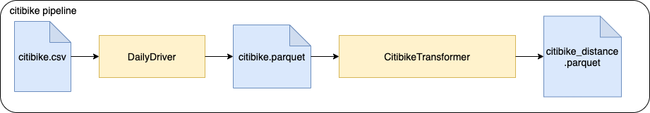

## Vaibhav's notes - 
- https://www.movable-type.co.uk/scripts/latlong.html - reference for latlong formula
- get word count thing - done(something wrong with the unit test though
- formmat header - wip
- get/understand spark udfs and get the citibike exericise done by udf and without udf as well
- common spark sql operations done via spark sql dataframe api(with string spark sql in comments) - cover group by, having, where, counts, distinct, window functions
- all unit tests done
- other stuff like csv to parquet conversion
- re-arrange and rename columns on df without using .withColumn 
- join two dfs with and without broadcast, with and without same hash partitioning schema, etc.
- .map and .flatmap on df - what's the difference, if any.

## Pre-requisites
Please make sure you have the following installed
* Java 8
* Scala 2.11
* Sbt 1.1.x

## Citibike
For analytics purposes the BI department of a bike share company would like to present dashboards, displaying the
distance each bike was driven. There is a `*.csv` file that contains historical data of previous bike rides. This input
file needs to be processed in multiple steps. There is a pipeline running these jobs.



There is a dump of the datalake for this under `test/resources/citibike/citibike.csv` with historical data.

### Ingest
Reads a `*.csv` file and transforms it to parquet format. The column names will be sanitized (whitespaces replaced).

##### Input
Historical bike ride `*.csv` file:
```csv
"tripduration","starttime","stoptime","start station id","start station name","start station latitude",...
364,"2017-07-01 00:00:00","2017-07-01 00:06:05",539,"Metropolitan Ave & Bedford Ave",40.71534825,...
...
```

##### Output
`*.parquet` files containing the same content
```csv
"tripduration","starttime","stoptime","start_station_id","start_station_name","start_station_latitude",...
364,"2017-07-01 00:00:00","2017-07-01 00:06:05",539,"Metropolitan Ave & Bedford Ave",40.71534825,...
...
```

### Distance calculation
This job takes bike trip information and calculates the "as the crow flies" distance traveled for each trip.
It reads the previously ingested data parquet files.

Hint: For distance calculation, consider using [**Harvesine formula**](https://en.wikipedia.org/wiki/Haversine_formula) as an option.

##### Input
Historical bike ride `*.parquet` files
```csv
"tripduration",...
364,...
...
```

##### Outputs
`*.parquet` files containing historical data with distance column containing the calculated distance.
```csv
"tripduration",...,"distance"
364,...,1.34
...
```